# Sesión 01 - Marco del problema

**Integrantes del equipo:** Sara Kasselis y Prune Ferru  

---

## 1. Contexto / Usuario

**¿Dónde ocurre?**  
En el espacio público urbano (calles, parques, circuitos de running como el Parque Forestal o Providencia) durante sesiones de entrenamiento individual o colectivo.

**¿A quién afecta?**  
A deportistas urbanos y estudiantes que buscan superar sus límites físicos, enfrentando barreras de fatiga mental y desmotivación durante el ejercicio prolongado.

**¿Qué prácticas, cuerpos, ambientes o comunidades están involucradas?**  
La práctica del running urbano, el cuerpo en esfuerzo cardiovascular (frecuencia cardíaca, sudoración, temperatura corporal), la interacción con la infraestructura de la ciudad y la comunidad de corredores.

---

## 2. Fenómeno / Problema

**¿Qué condición queremos observar o hacer visible?**  
La acumulación del esfuerzo y la progresión continua en tiempo real, convirtiendo datos biológicos invisibles (ritmo cardíaco, cadencia, sudoración, temperatura) en manifestaciones físicas o visuales perceptibles.

**¿Por qué importa?**  
Durante el esfuerzo prolongado, la fatiga incrementa la percepción del esfuerzo y debilita la motivación. Acceder a un retorno tangible inmediato (sin depender de pantallas que distraigan) genera un estímulo positivo (*feedback loop*) que ayuda a mantener la constancia.

**¿Qué tensión aparece?**  
La tensión entre el agotamiento físico interno (deseo de rendirse) y la visualización externa del logro en construcción (motivación para continuar).

---

## 3. Referentes

### Referente 1: MYSA — Pauline van Dongen (2023)
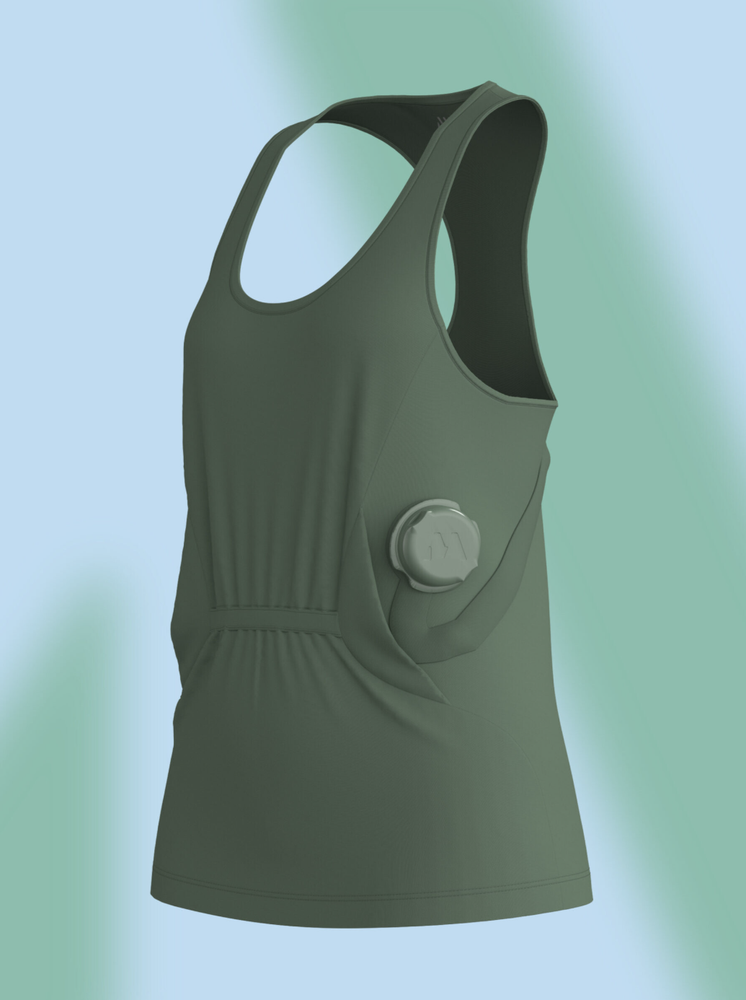  
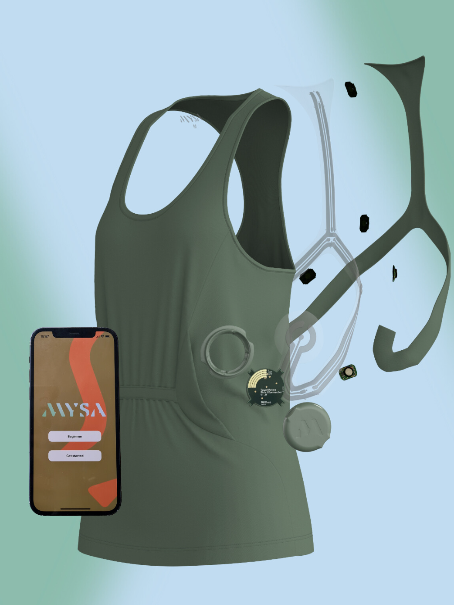  
*Figura 1: Vista general y despiece tecnológico con integración de actuadores hápticos.*  
* **Créditos y equipo:** Pauline van Dongen & Touchwaves (2M Engineering).  
* **Descripción:** MYSA es una prenda creada en 2023 por la diseñadora neerlandesa Pauline van Dongen. Utiliza vibraciones para guiar la respiración y ayudar al usuario a tomar conciencia de su estado corporal.  
* **¿Por qué esta referencia?** Esta referencia nos interesa porque transforma un dato del cuerpo en una interacción con la prenda. Se relaciona con nuestro proyecto, que busca traducir los datos del esfuerzo físico en una transformación visible del textil, con el fin de hacer perceptible la progresión.

---

### Referente 2: SKYNFEEL™ APPAREL — Pauline van Dongen (2016)
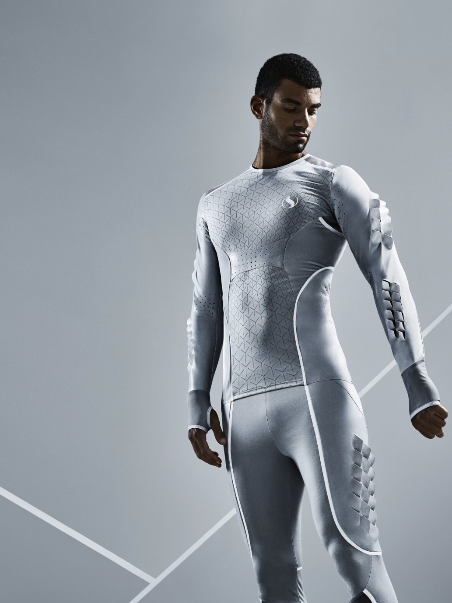  
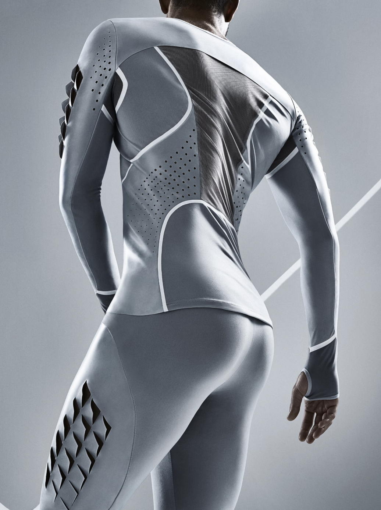  
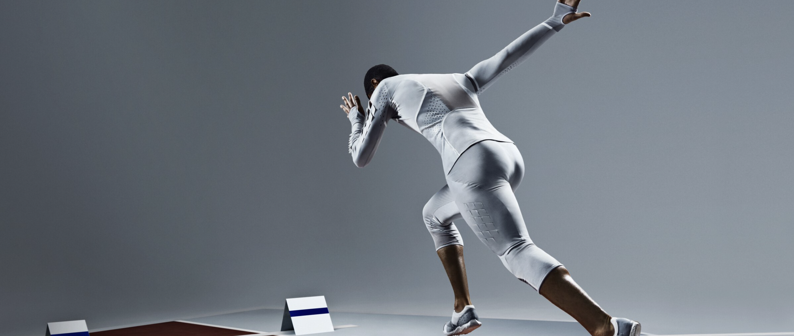  
*Figura 2: Vistas frontal, posterior y traje en uso atlético con flaps geométricos impresos en 3D.*  
* **Créditos y equipo:** Pauline van Dongen en colaboración con SKYN® Condoms.  
* **Descripción:** SKYNFEEL™ APPAREL es un traje conceptual creado en 2016 destinado a atletas de salto de longitud. Utiliza un material ligero inspirado en las alas de las libélulas: unas solapas integradas en la prenda se abren durante el salto para crear una mayor sustentación.  
* **¿Por qué esta referencia?** Esta referencia nos interesa porque muestra cómo el movimiento del cuerpo puede transformar directamente la forma de una prenda. Nos inspira para nuestro proyecto porque también queremos que los datos relacionados con el esfuerzo provoquen una evolución física del textil, en lugar de ser simplemente mostrados.

---

### Referente 3: PHOTOTROPE — Pauline van Dongen (2015)
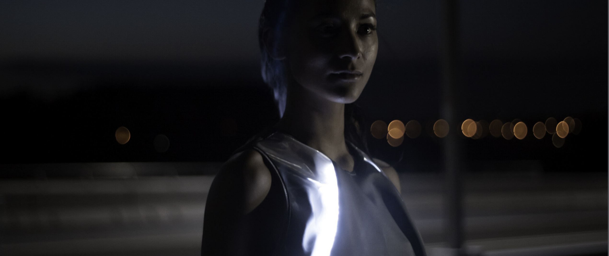  
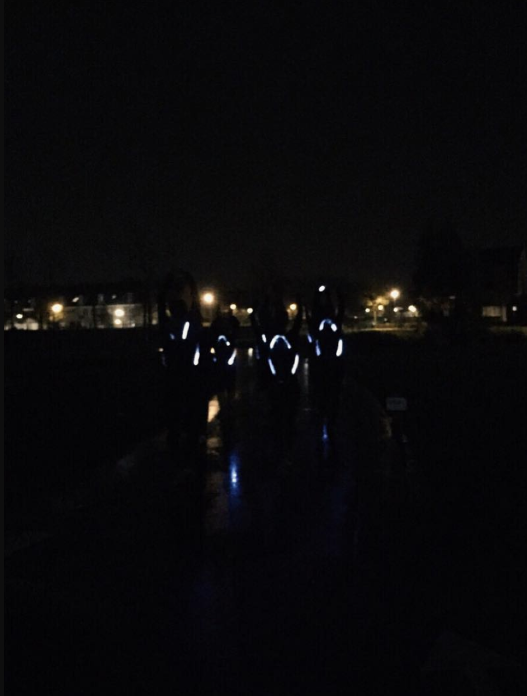  
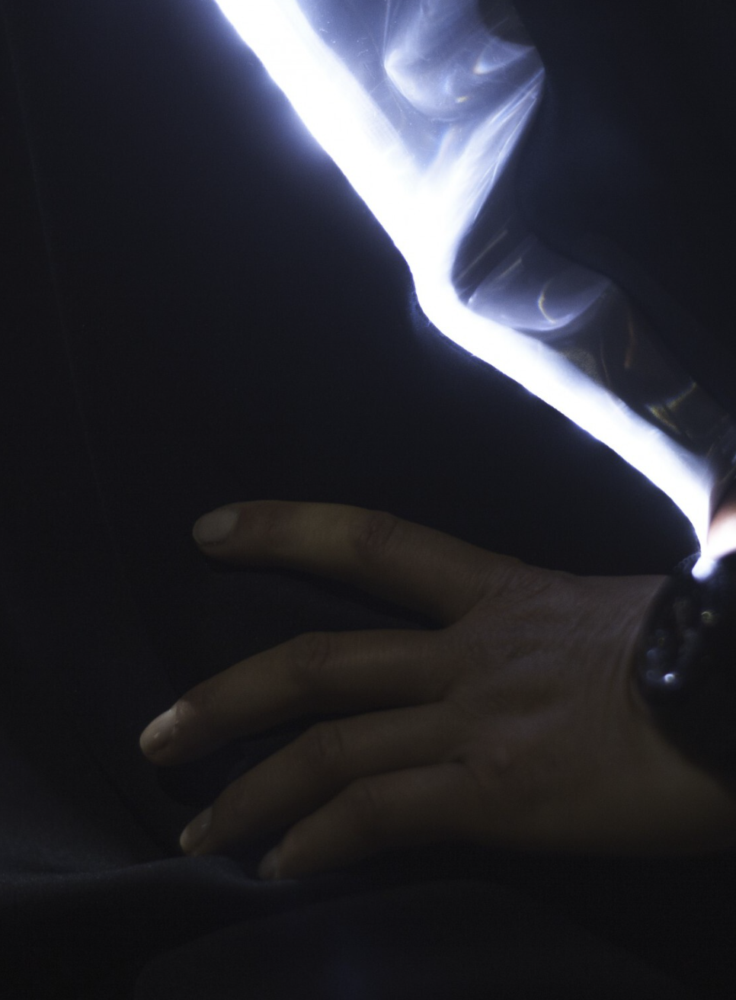  
*Figura 3: Integración de iluminación en indumentaria deportiva y uso nocturno.*  
* **Créditos y equipo:** Pauline van Dongen Studio & Philips.  
* **Descripción:** Phototrope es una prenda deportiva para correr creada en 2015 que integra elementos luminosos en el textil para hacer que el corredor sea más visible en la oscuridad.  
* **¿Por qué esta referencia?** Esta referencia nos interesa por su uso de la luz como medio para transmitir información. A diferencia de nuestras otras referencias, que se centran principalmente en el material, el movimiento o las sensaciones, Phototrope abre una nueva posibilidad para nuestro proyecto: utilizar la luz para traducir visualmente los datos del esfuerzo y hacer perceptible la progresión del deportista.

---

### Referente 4: SOLAR SHIRT — Pauline van Dongen (2015)
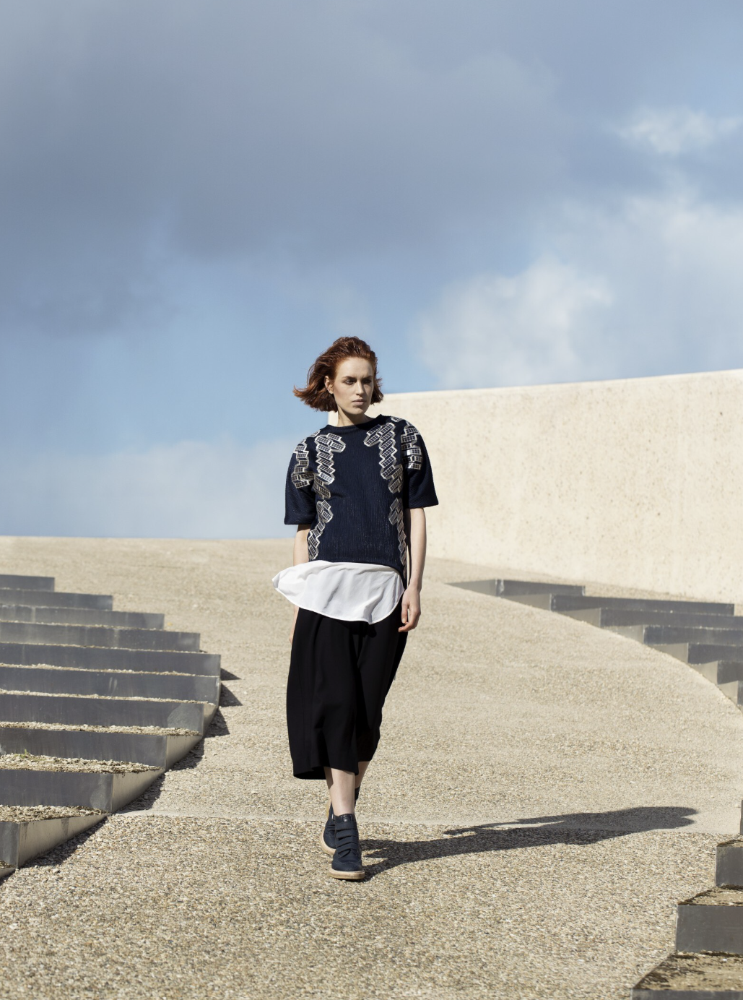  
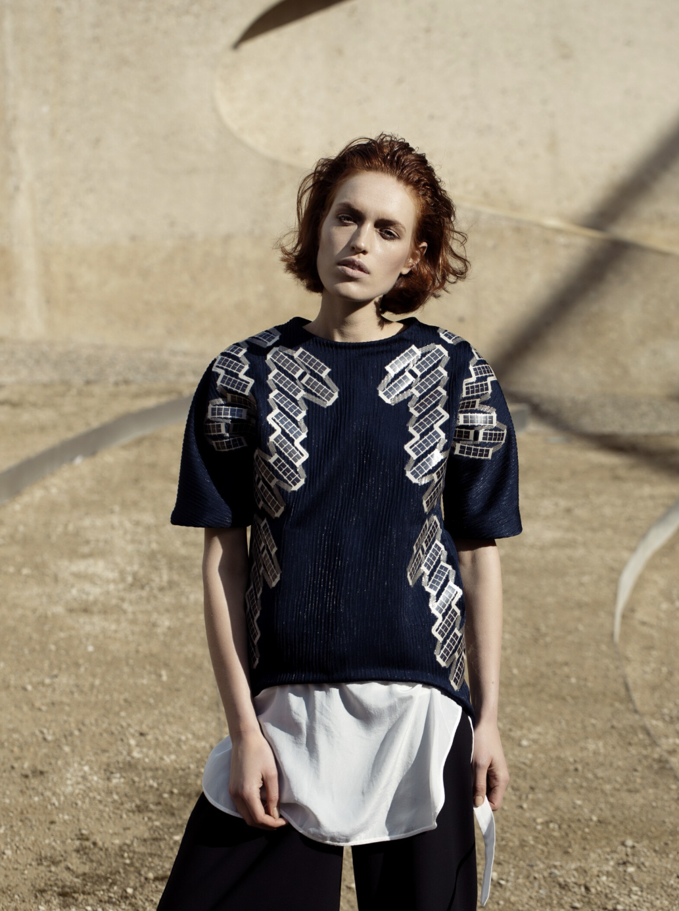  
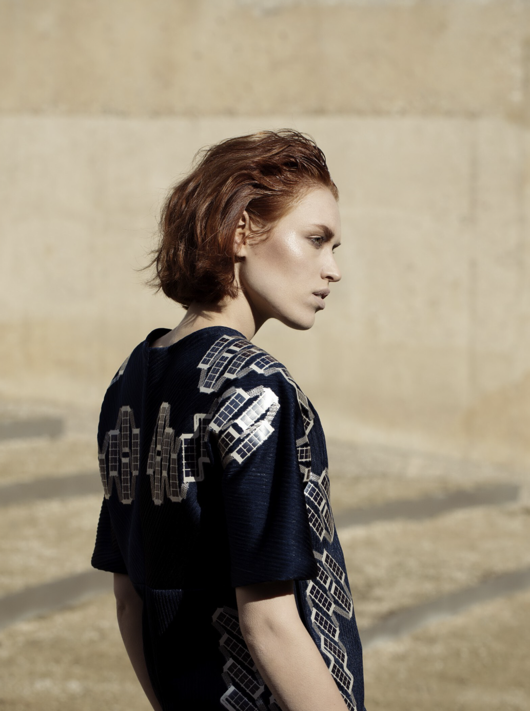  
*Figura 4: Integración y detalles de células solares flexibles en textil.*  
* **Créditos y equipo:** Pauline van Dongen & Holst Centre / TNO.  
* **Descripción:** Solar Shirt es una prenda creada en 2015 en colaboración con el Holst Centre. Integra células solares directamente en el textil para captar la energía del sol y transformarla en electricidad. De este modo, el cuerpo se convierte en un intermediario entre la prenda y su entorno.  
* **¿Por qué esta referencia?** Esta referencia nos interesa porque pone en relación el cuerpo, la prenda y una fuente de energía exterior: el sol. En nuestro proyecto, el cuerpo humano también desempeña un papel central: su movimiento y los datos producidos durante el esfuerzo se convierten en la fuente de una transformación de la prenda. Esto nos lleva a considerar el cuerpo como productor de datos y energía capaces de actuar directamente sobre el textil.

---

### Referente 5: METAL LAMINA RIPSTOP HEAT REACTIVE — Stone Island (2026)
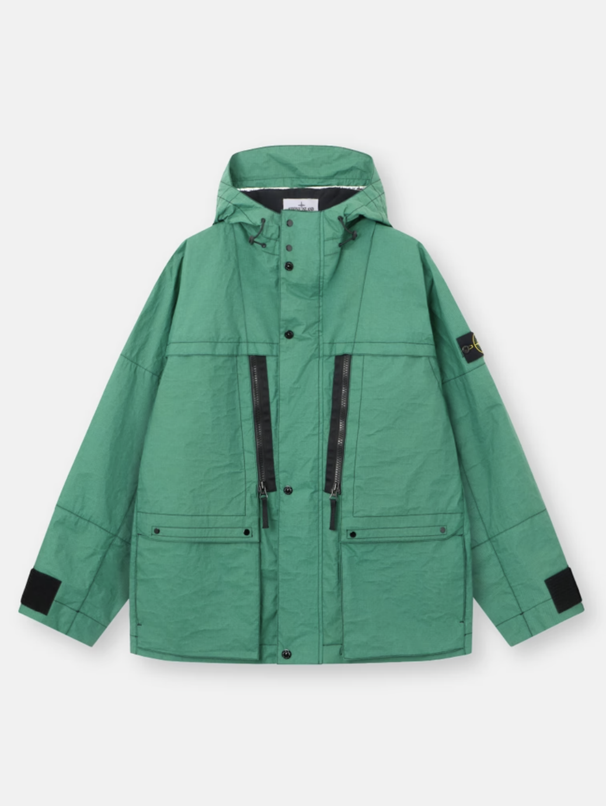  
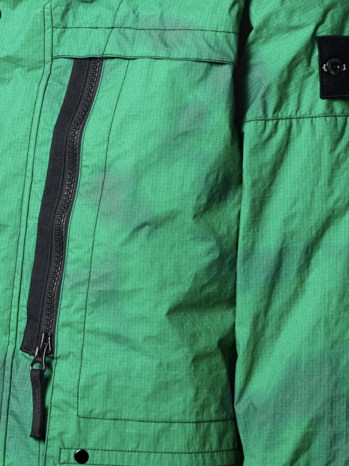  
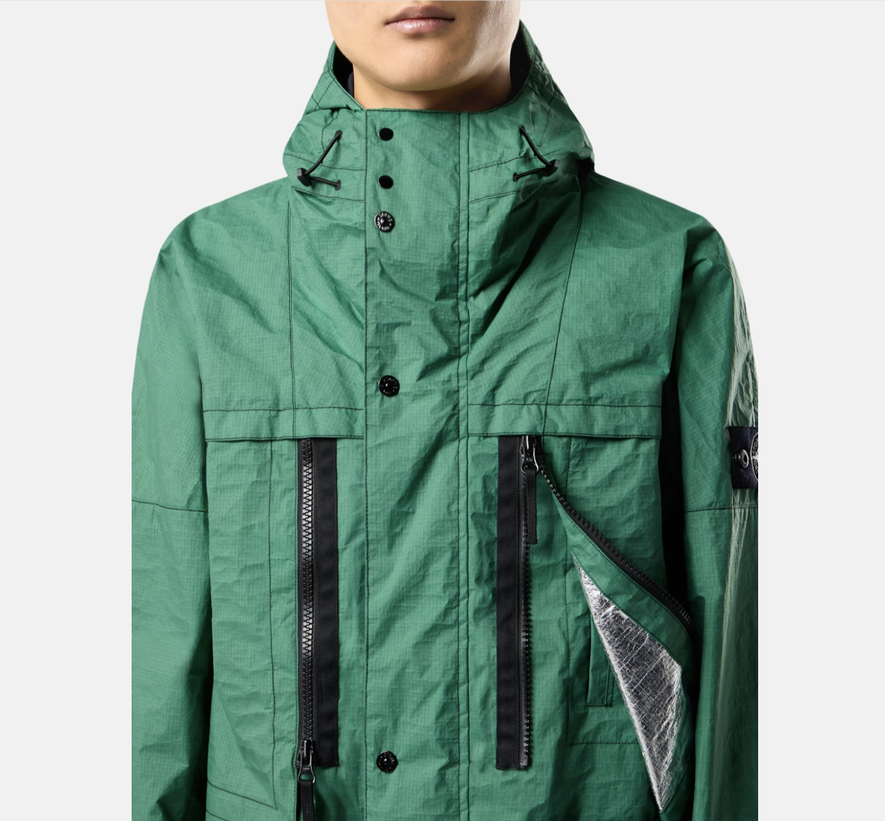  
*Figura 5: Chaqueta con pigmentos termorreactivos y reacción al cambio de temperatura.*  
* **Créditos y equipo:** Stone Island.  
* **Descripción:** Esta chaqueta de Stone Island utiliza un pigmento termorreactivo que modifica su color en función de la temperatura: se vuelve más clara cuando aumenta el calor y recupera su color inicial cuando la temperatura disminuye.  
* **¿Por qué esta referencia?** Esta referencia nos interesa porque muestra cómo el calor del cuerpo puede transformar directamente la apariencia de una prenda. Se relaciona especialmente con nuestro proyecto deportivo: durante el esfuerzo, el cuerpo produce calor y este dato podría convertirse en una forma de hacer visible la intensidad o la progresión del esfuerzo directamente sobre el textil, sin pantalla. Por lo tanto, nos abre una posibilidad en torno a los materiales termorreactivos.

---

### Referente 6: BIOLOGIC — MIT Media Lab (2015)
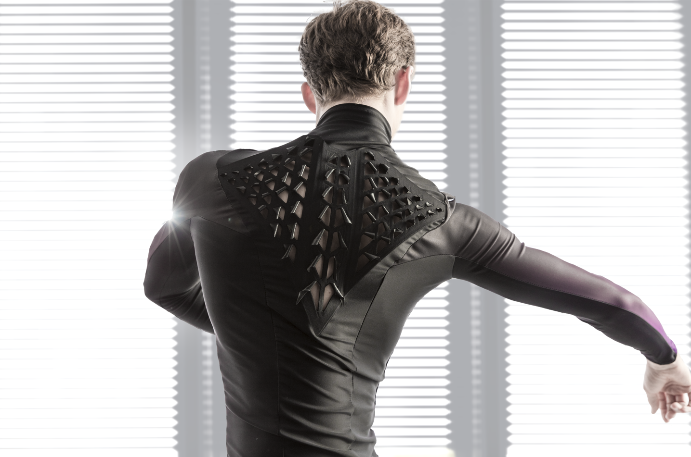  
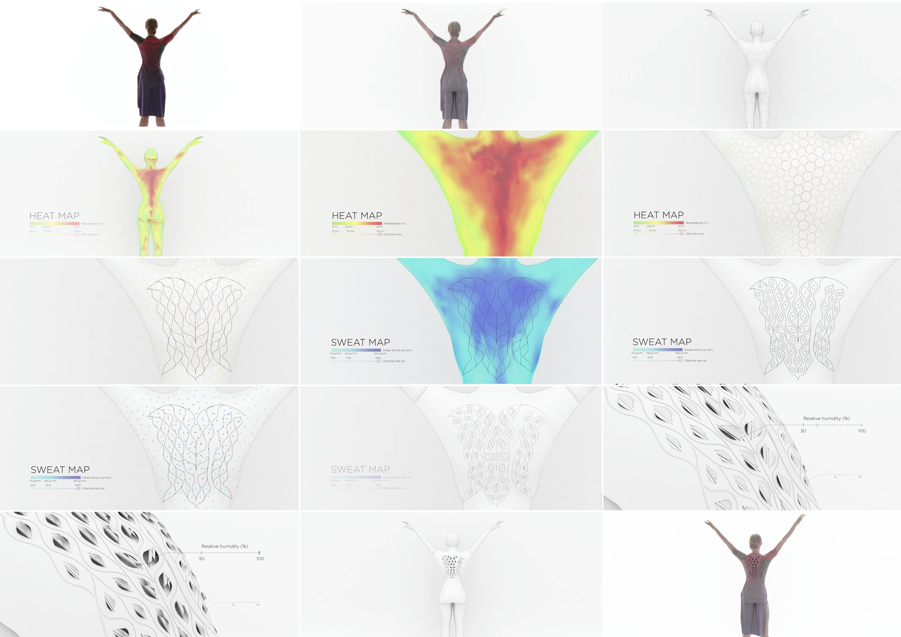  
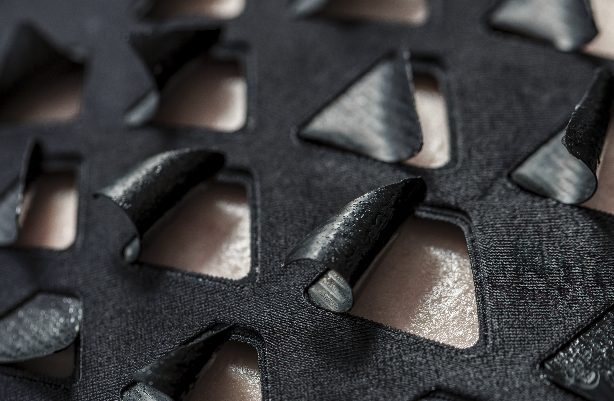  
*Figura 6: Mapeo de ventilación y comportamiento del material bio-reactivo.*  
* **Créditos y equipo:** MIT Media Lab (Tangible Media Group) en colaboración con Royal College of Art y New Balance.  
* **Descripción:** BioLogic es un proyecto desarrollado por el Tangible Media Group del MIT Media Lab. La prenda utiliza bacterias de *Bacillus subtilis natto* que reaccionan al calor y a la transpiración del cuerpo: las aberturas del textil se despliegan para favorecer la evaporación y refrescar al deportista.  
* **¿Por qué esta referencia?** Esta referencia está especialmente relacionada con nuestro proyecto porque utiliza directamente las reacciones del cuerpo durante el esfuerzo como dato para transformar la prenda.

---

### Referente 7: Sweat Activated Tank Top — Actizio
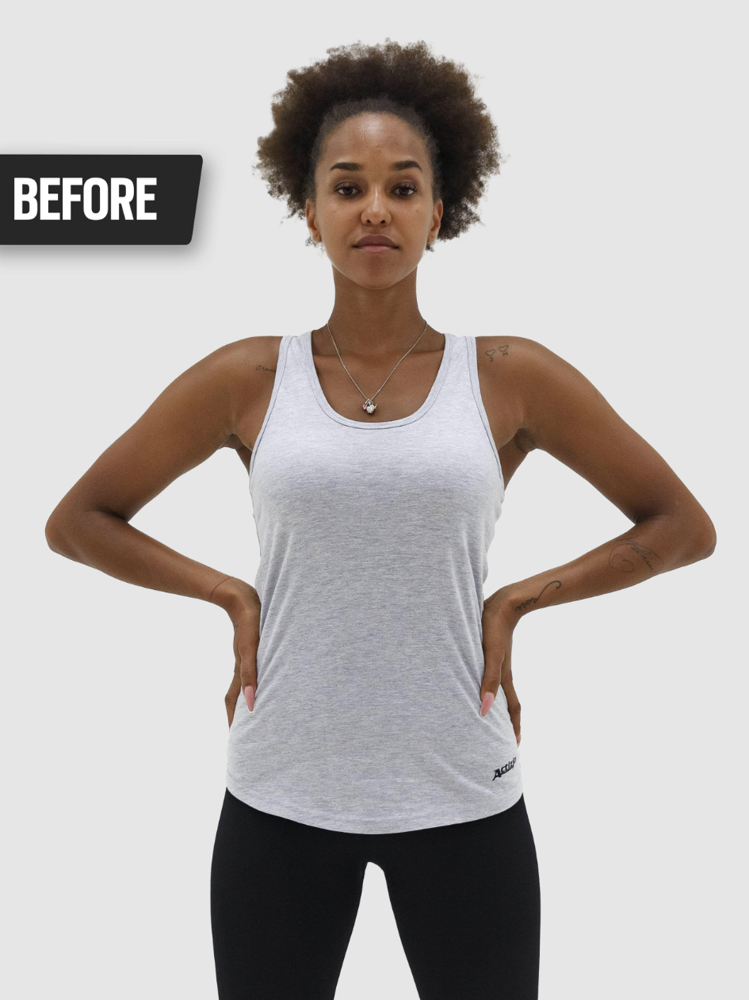  
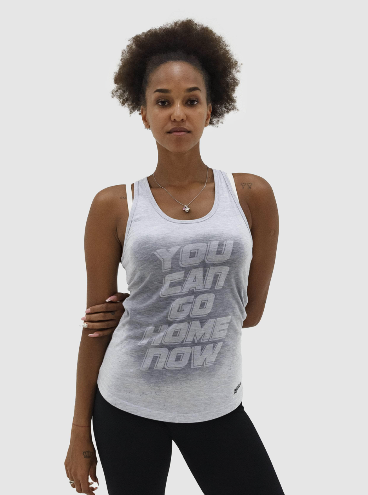  
*Figura 7: Revelación del mensaje motivacional «YOU CAN GO HOME NOW» activado por la transpiración.*  
* **Créditos y equipo:** Actizio.  
* **Descripción:** Es una prenda deportiva que utiliza una tecnología activada por la sudoración. Cuando el cuerpo transpira durante el ejercicio, un mensaje oculto aparece progresivamente en el textil: «YOU CAN GO HOME NOW». Cuanto mayor es el esfuerzo, más visible se vuelve el mensaje.  
* **¿Por qué esta referencia?** Esta referencia está especialmente relacionada con nuestro proyecto porque utiliza la transpiración como un dato producido por el cuerpo para hacer evolucionar visualmente la prenda. Muestra que una información relacionada con el esfuerzo puede materializarse directamente en el textil. Por lo tanto, nos interesa para nuestra reflexión sobre cómo transformar los datos del esfuerzo en una representación visible de la progresión, manteniendo al mismo tiempo una dimensión motivadora.

---

## 4. Variable e Hipótesis de Dispositivo

**Variables a medir u observar:**  
La acumulación del esfuerzo físico y cardiovascular (frecuencia cardíaca, BPM, temperatura corporal, sudoración) y la cadencia del paso (pasos por minuto).

**Primera hipótesis de dispositivo:**  
Un dispositivo interactivo *wearable* (arnés, estructura textil o accesorio biomecánico impreso en 3D/corte láser) colocado sobre el cuerpo del corredor. Este traduce de forma progresiva la acumulación del esfuerzo en una transformación morfológica, mecánica, de color o lumínica en la superficie de la prenda, permitiendo al usuario sentir y ver su avance de forma intuitiva e inmediata sin depender de pantallas ni interrumpir la carrera.

  
*Figura 8: Cartografía corporal (Body Mapping) que detalla las zonas anatómicas de captura de datos biológicos (entradas) y las áreas de manifestación gráfica o física en la prenda (salidas).*

  
*Figura 9: Croquis conceptual de exploración gráfica que ilustra la revelación de un patrón progresivo en el textil durante la carrera.*

  
*Figura 10: Diagrama sintético del bucle de retroalimentación (Feedback Loop), mostrando la relación directa entre el cuerpo, la transformación del textil y la motivación del corredor.*

> **Nota de trabajo:**  
> Estos tres croquis representan nuestra primera hipótesis visual y funcional. En las próximas clases probaremos diferentes materiales y sensores para definir la solución técnica definitiva.
